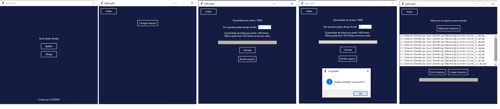

# Excel Splitter & Merger ⚡

<p align="center">
  
</p>

A lightweight **Python/Tkinter** desktop tool that lets you:

1. **Split** a large Excel workbook (`.xlsx`) into equal‑sized *batches*  
2. **Merge** those processed batches back into a single file  

The app was built to speed up automation pipelines that run heavy data transformations in parallel.

---

## ✨ Highlights

| Capability | Details |
|------------|---------|
| **Row counter** | Reads the selected workbook and shows total rows instantly |
| **Smart slicing** | Evenly distributes rows; last batch gets the remainder |
| **Automated naming** | Saves batches as `Lote_1.xlsx`, `Lote_2.xlsx`, … |
| **Header safety** | Keeps the original header in every batch & final merge |
| **Progress bars** | Real‑time feedback for both split & merge operations |
| **Threaded tasks** | Heavy I/O runs in background threads to keep UI responsive |
| **Format friendly** | Forces every cell to **text** format to avoid type issues |

---

## 🛠️ Tech Stack

| Layer | Library |
|-------|---------|
| GUI   | `tkinter`, `ttk`, `Pillow` (logo) |
| Data  | `pandas`, `openpyxl` |
| Concurrency | `threading` |
| Python | 3.10 + |

---

## ⚙️ Installation

```bash
git clone ...
cd excel‑splitter‑merger

# create optional virtual environment
python -m venv .venv
source .venv/bin/activate     # Windows: .venv\Scripts\activate

# install dependencies
pip install -r requirements.txt
# (pandas openpyxl pillow)

# launch
python Gui.py
```

---

## 🚀 Usage

1. **Splitter**  
   - Click **Carregar Arquivo** and pick a large `.xlsx`.  
   - Enter how many batches you need and press **Calcular**.  
   - Hit **Dividir arquivo** – watch the progress bar. Files `Lote_N.xlsx` are saved in the same folder.

2. **Merge**  
   - Go to **Merge** and pick all the batch files (order doesn’t matter).  
   - Press **Unir Arquivos**. The combined workbook `Resultado_Merge.xlsx` is created alongside your batches.

> **Tip:** Each cell in the output keeps *text* format, preventing unwanted type conversions later.

---

## Author
Project created by **Leonardo Grupioni** – 2024